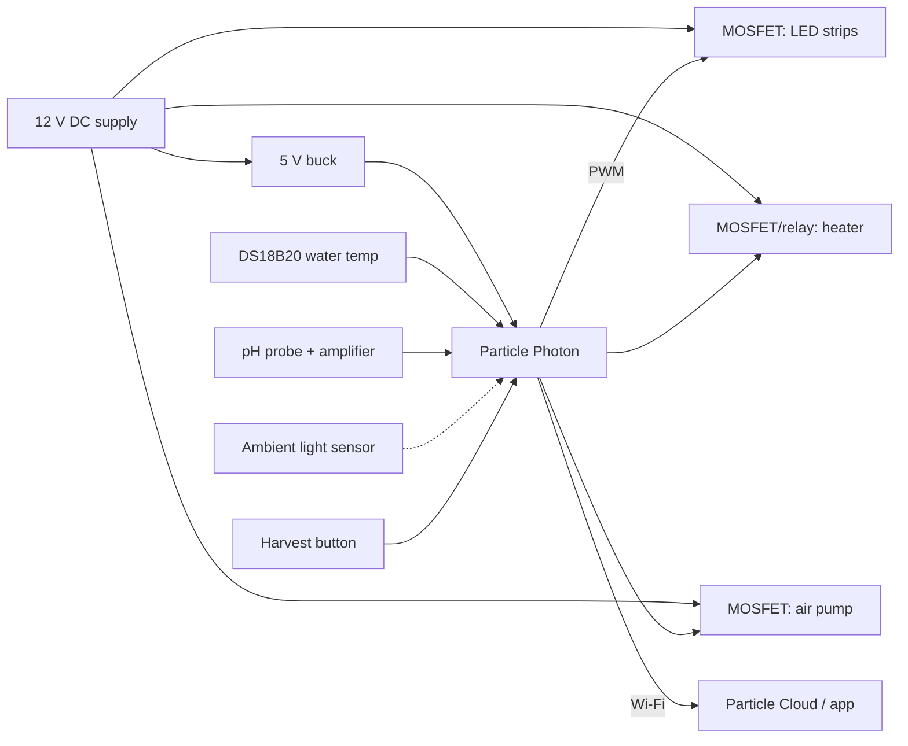

# Sol-1

**A countertop photobioreactor for growing fresh spirulina protein at home, designed by [Spira Inc.](https://www.spirainc.com/)**

Sol-1 is a self-contained, sensor-controlled tank that keeps a live *Arthrospira platensis* (spirulina) culture warm, lit and circulating, and lets you harvest a daily serving of fresh algae through a mesh filter. This repository documents the purpose, specifications, and the full build: CAD, electronics, enclosure, assembly, firmware for the Particle Photon, and day-to-day operation.

> **About this document.** It was drafted from Spira's public material and standard spirulina cultivation practice. Items marked **[confirm]** are reasonable defaults that should be replaced with the actual Sol-1 values, part numbers and file links as they are finalized.

---

## Table of contents

- [Background](#background)
- [Specifications](#specifications)
- [Prototyping](#prototyping)
- [CAD Modeling](#cad-modeling)
- [Electronics](#electronics)
  - [Breadboard](#breadboard)
  - [Fritzing](#fritzing)
  - [Schematic](#schematic)
  - [PCB Design](#pcb-design)
- [Tank Enclosure](#tank-enclosure)
  - [Laser Cutting Acrylic](#laser-cutting-acrylic)
  - [Gluing It Together](#gluing-it-together)
  - [Routing Base](#routing-base)
- [Soldering + Assembly](#soldering--assembly)
- [Particle Photon](#particle-photon)
- [Code](#code)
- [Operating the Reactor](#operating-the-reactor)
- [Safety](#safety)
- [Sources](#sources)

---

## Background

Spira was founded in March 2016 by Elliot Roth with fellow VCU graduates Peter Lee and Surian Singh to grow, process and engineer spirulina for protein in simple, scalable devices. The idea traces back to NASA and ESA studies that evaluated spirulina as a food source for long-duration spaceflight: it is roughly 60% protein by dry weight, contains all the essential amino acids, and grows fast in a shallow, alkaline, brightly lit tank.

Spira's early products were hobbyist grow kits (v0.3 by late 2017): a live culture, growth medium, and the aquarium-grade parts needed to keep it alive. The next step was a fully enclosed device that removes the guesswork. Sol-1 is that device: an integrated photobioreactor that

- holds the culture at its preferred temperature and light schedule automatically,
- keeps the cells gently circulating so every cell sees light,
- reports temperature and pH so you know when to feed or harvest, and
- filters a serving of fresh spirulina on demand.

The design goal that drove the early prototypes was **10–20 g of protein per day** from a countertop unit. Spira's published countertop concept produces about two tablespoons of fresh spirulina daily (roughly 4.5 g dried), which sets a realistic baseline for a compact unit.

**Why spirulina?**

| Property | Value |
|---|---|
| Protein (dry weight) | ~60% |
| Amino acids | All essential amino acids present |
| Micronutrients | Iron, B vitamins, beta-carotene, phycocyanin |
| Growth form | Free-floating filaments, harvested by simple filtration |
| Side benefit | Consumes CO₂ and releases O₂ while it grows |

---

## Specifications

Target operating envelope for Sol-1. Values with a source are the published ones; the rest are engineering defaults to be confirmed against the built unit.

| Parameter | Target | Notes |
|---|---|---|
| Organism | *Arthrospira platensis* | Live starter culture from Spira |
| Culture volume | 4 L **[confirm]** | Countertop footprint; scales with tank depth and LED power |
| Temperature | 35 °C setpoint, 30–37 °C range | Heater in base; growth slows sharply below 25 °C |
| pH | 9.5–10.5 (alkaline) | Bicarbonate-buffered medium; pH rises as CO₂ is consumed |
| Light | ~5 W of LED per litre, 16 h on / 8 h off | Cool-white or warm-white strips; even wall coverage |
| Circulation | Airlift (air pump + riser tube) | Gentle mixing without shearing filaments |
| Harvest | Push-button drain through stainless mesh | ~50 µm mesh, medium returns to tank |
| Expected yield | 2 tbsp fresh/day (~4.5 g dry) | Harvest no more than once per 24 h |
| Power | 12 V DC, ~60 W peak **[confirm]** | LEDs + heater + pump; Photon on 5 V |
| Connectivity | Wi-Fi via Particle Photon | Cloud variables and functions, OTA updates |
| Sensors | Water temperature, pH, ambient light **[confirm]** | Optional: turbidity for density |
| Enclosure | Laser-cut cast acrylic tank on a routed base | Food-contact surfaces: acrylic, silicone, stainless |

---

## Prototyping

The first prototypes were the grow kit in a jar: a clear container, an aquarium heater with a thermostat, an air pump and airstone, a thermometer, a pH meter, and a fine mesh for harvesting. Running those for about a year taught the lessons that shaped Sol-1:

1. **Light reaches only a few centimetres into a dense culture.** A tall, narrow tank lit from the outside beats a wide bowl. Keep the light path short.
2. **Circulation must be gentle.** Impellers shear the spiral filaments; an airlift moves the whole column slowly and evenly and adds gas exchange for free.
3. **Temperature is the biggest lever.** Warm cultures double in days; cool ones stall and get outcompeted by contaminants.
4. **pH drifts up as the culture grows.** That is normal and protective (few organisms tolerate pH 10), but it needs monitoring so you know when to feed bicarbonate.
5. **Evaporation and splash matter.** A lid, a drip edge, and a wiring path that stays dry make the difference between a demo and an appliance.

Prototype sequence **[confirm]**:

| Version | What changed |
|---|---|
| v0.1 | Jar, aquarium heater, air pump, manual harvest |
| v0.2 | Acrylic tube, LED strip wrapped around the outside, timer |
| v0.3 | Hobbyist kit sold by Spira; standard medium and harvest screen |
| Sol-1 | Enclosed unit, Photon control, integrated harvester |

---

## CAD Modeling

The enclosure is modelled as a flat-pack of laser-cut acrylic panels plus a routed base so that every part can be made on a laser cutter and a router without custom moulds.

**Parts in the model**

- **Tank**: four walls and a floor, tabbed for solvent welding, plus a lid with a cutout for the airlift riser and a port for the sensors.
- **LED channels**: standoffs or a second skin that holds LED strips a fixed distance from the tank wall so light is even and the strips stay dry.
- **Harvester**: a drawer or tray beneath the drain with a frame that stretches the stainless mesh.
- **Base**: a routed block that seats the tank, hides the heater pad, and houses the PCB, air pump and power inlet.

**Modelling notes**

- Model acrylic at its measured thickness (nominal 3 mm sheet is often 2.8–3.2 mm) and set the tab/slot fit as a parameter so the whole model updates.
- Compensate for laser kerf (~0.15–0.25 mm) in the export, not the model.
- Keep a single parameter for culture volume and derive tank height from it.
- Export walls as DXF for the laser, the base as STEP or a toolpath for the router.

Files **[confirm]**: `cad/` (source), `cad/dxf/` (cut files), `cad/step/` (exchange).

---

## Electronics

The controller reads temperature and pH, switches the heater, dims the LEDs on a schedule, runs the air pump, and exposes everything over Wi-Fi.



**Bill of materials [confirm part numbers]**

| Qty | Part | Purpose |
|---|---|---|
| 1 | Particle Photon (P1/Photon 2 compatible) | Wi-Fi microcontroller |
| 1 | 12 V, 5 A DC supply with barrel jack | Main power |
| 1 | 12 V → 5 V buck converter (≥1 A) | Photon and logic |
| 2–3 | Logic-level N-MOSFET (e.g. IRLZ44N) | LED, pump, heater switching |
| 1 | 12 V silicone heater pad, 20–30 W, or aquarium heater | Culture temperature |
| 1 | 12 V air pump + check valve + airstone | Airlift circulation |
| 1–2 | 12 V LED strip, 5–7 W per litre total | Illumination |
| 1 | DS18B20 waterproof probe + 4.7 kΩ pull-up | Water temperature |
| 1 | pH probe (BNC) + analog amplifier board | Culture pH |
| 1 | Momentary button, panel mount | Harvest / manual override |
| 1 | Flyback diodes, fuses, screw terminals, headers | Protection and wiring |

### Breadboard

Bring up one subsystem at a time on a breadboard before anything is soldered:

1. Power the Photon from the buck converter and get it claimed and online.
2. Read the DS18B20 in a glass of warm water; confirm the value tracks a thermometer.
3. Calibrate the pH board with pH 7 and pH 10 buffers; record the slope and offset.
4. Drive one LED strip from a MOSFET with PWM and confirm it dims smoothly.
5. Switch the heater and the pump the same way; check the MOSFET stays cool.
6. Run the control loop in the open air for a day before it touches the culture.

### Fritzing

The breadboard layout and wiring are kept as a Fritzing sketch (`electronics/sol-1.fzz` **[confirm]**). Proposed pin map:

| Photon pin | Signal | Notes |
|---|---|---|
| D0 | Heater MOSFET gate | Digital on/off with hysteresis |
| D1 | LED MOSFET gate | PWM, 0–255 |
| D2 | Air pump MOSFET gate | On/off or PWM for quieter operation |
| D3 | Harvest button | Input with pull-up, active low |
| D4 | DS18B20 data | 1-Wire, 4.7 kΩ pull-up to 3.3 V |
| A0 | pH amplifier output | 0–3.3 V; scale in firmware |
| A1 | Ambient light sensor | Optional |
| VIN / GND | 5 V in, common ground | All grounds tied together |

### Schematic

Design rules for the schematic:

- One common ground for the 12 V loads, the 5 V rail and the sensors.
- Logic-level MOSFETs so 3.3 V from the Photon fully turns them on; add a 100 Ω gate resistor and a 10 kΩ pull-down so outputs stay off at boot.
- Flyback diode across the air pump and any relay coil.
- Fuse the 12 V input; keep the heater on its own fuse.
- pH probes are high-impedance: keep the BNC and amplifier away from the switching MOSFETs and heater wiring.
- Bring the sensor connectors and the button to the edge of the board for panel mounting.

### PCB Design

A small two-layer board that carries the Photon on female headers, the buck converter as a module, the three MOSFET stages, screw terminals for 12 V loads, and JST connectors for sensors. Suggested tooling: KiCad; fabricate at any low-cost service. Keep high-current traces short and wide (≥2 mm for the heater and LED returns), and put a ground pour under the analog section. Mount the board in the routed base with the terminals facing the wiring channel.

Files **[confirm]**: `electronics/kicad/`, gerbers in `electronics/gerbers/`.

---

## Tank Enclosure

The tank is built from **cast** acrylic (not extruded): cast sheet solvent-welds cleanly and does not craze when laser cut. Use 4–6 mm for the walls and floor of a 4 L tank and 3 mm for the lid and trim. Everything that touches the culture should be acrylic, silicone, glass or stainless steel.

### Laser Cutting Acrylic

- Cut from the DXF exports with the protective film left on both faces; peel it only when welding.
- Kerf is typically 0.15–0.25 mm; test a tab/slot coupon on the actual sheet before cutting the full set.
- Cut tabs slightly proud so joints close with light pressure; loose joints leak.
- Ventilate: acrylic fumes are unpleasant and the laser must be run with extraction.
- Flame-polish or leave the edges as cut; do not sand the joint faces, the solvent needs a clean surface.

### Gluing It Together

1. Dry-fit the walls and floor and tape them square.
2. Apply a water-thin solvent cement (Weld-On 3 or 4, or equivalent) with a needle applicator along the inside of each seam; capillary action pulls it through the joint.
3. Hold with clamps or tape and leave the assembly undisturbed for 24 hours.
4. Run a bead of aquarium-safe silicone along the inside seams for a second seal, and cure 24–48 hours.
5. Fill with water and leave it on paper towels overnight before it ever holds culture.

### Routing Base

The base is a routed block of plywood or HDPE **[confirm]** that gives the tank a footprint, holds the heater against the floor and hides the electronics.

- Pocket a shallow recess the exact size of the tank floor so the tank cannot slide.
- Pocket a second recess for the heater pad so the tank sits flat on it, with a channel for its leads.
- Route a compartment for the PCB, buck converter and air pump, and a slot for the barrel jack and button.
- Cut a wiring channel from the compartment up to the LED strips and the sensor port in the lid.
- Seal wood bases with polyurethane; spilled culture is alkaline and salty.

---

## Soldering + Assembly

1. Populate the PCB from the lowest parts up: resistors and diodes, then headers, terminals and MOSFETs. Socket the Photon rather than soldering it.
2. Solder leads to the LED strips and heat-shrink every joint; the strips live next to a tank of salt water.
3. Mount the strips on the LED channels with the diodes facing the tank wall at an even spacing.
4. Fit the DS18B20 and pH probe through the lid port with silicone grommets so the lid still seals.
5. Route the airline from the pump through a check valve to the airstone at the bottom of the riser tube.
6. Seat the heater pad, then the tank, then dress the wiring into the base channel with strain relief at both ends.
7. Power up with the tank full of plain water: check the heater warms it, the LEDs follow the schedule, and the pump lifts water through the riser.

---

## Particle Photon

The Photon was chosen because it makes a headless appliance easy: built-in Wi-Fi, over-the-air firmware updates, and a cloud API that exposes variables and functions without writing a server.

**Setup**

```bash
npm install -g particle-cli
particle login
particle setup                 # put the Photon on your Wi-Fi and claim it
particle compile photon firmware/ --saveTo sol1.bin
particle flash <device-name> sol1.bin
```

**Cloud interface**

| Type | Name | Description |
|---|---|---|
| Variable | `tempC` | Water temperature, °C |
| Variable | `pH` | Culture pH |
| Variable | `state` | JSON: heater, LED level, pump, hours since harvest |
| Function | `setLight(level)` | Override LED level 0–100, or `auto` |
| Function | `setTemp(c)` | Change the heater setpoint |
| Function | `harvest()` | Open the drain for the configured time |
| Event | `sol1/alert` | Published when temperature or pH leaves its band |

Read a value from anywhere:

```bash
particle get <device-name> tempC
particle call <device-name> harvest
```

---

## Code

Firmware lives in `firmware/` **[confirm]** and is written for Particle Device OS (Wiring-style C++). Structure:

```
firmware/
  sol1.ino          # setup(), loop(), cloud registration
  control.h/.cpp    # heater hysteresis, light schedule, pump duty
  sensors.h/.cpp    # DS18B20 and pH reading, calibration constants
  config.h          # pins, setpoints, schedule
```

Core control loop:

```cpp
#include "DS18B20.h"

const int PIN_HEATER = D0, PIN_LED = D1, PIN_PUMP = D2, PIN_BTN = D3, PIN_TEMP = D4, PIN_PH = A0;
double tempC = 0, pH = 0;
double setpoint = 35.0;          // °C
const double hysteresis = 0.5;   // heater on below 34.5, off above 35.5
const int lightOn = 6, lightOff = 22;   // local hours

DS18B20 probe(PIN_TEMP, true);

void setup() {
  pinMode(PIN_HEATER, OUTPUT); pinMode(PIN_LED, OUTPUT); pinMode(PIN_PUMP, OUTPUT);
  pinMode(PIN_BTN, INPUT_PULLUP);
  Particle.variable("tempC", tempC);
  Particle.variable("pH", pH);
  Particle.function("setTemp", setTemp);
  Time.zone(-5);                 // set to local offset
  digitalWrite(PIN_PUMP, HIGH);  // airlift runs continuously
}

void loop() {
  static unsigned long last = 0;
  if (millis() - last < 5000) return;
  last = millis();

  float t = probe.getTemperature();
  if (probe.crcCheck()) tempC = t;
  pH = readPH(analogRead(PIN_PH));

  // Heater: bang-bang with hysteresis and a sensor-fault cutoff
  bool sensorOk = tempC > 0 && tempC < 60;
  if (!sensorOk || tempC > setpoint + hysteresis) digitalWrite(PIN_HEATER, LOW);
  else if (tempC < setpoint - hysteresis)          digitalWrite(PIN_HEATER, HIGH);

  // Lights: schedule by wall-clock hour
  int h = Time.hour();
  analogWrite(PIN_LED, (h >= lightOn && h < lightOff) ? 255 : 0);

  if (tempC > 38 || pH < 8.5 || pH > 11) Particle.publish("sol1/alert", String::format("t=%.1f pH=%.2f", tempC, pH), PRIVATE);
}

int setTemp(String c) { setpoint = c.toFloat(); return (int)setpoint; }

double readPH(int raw) {
  const double volts = raw * 3.3 / 4095.0;
  const double slope = -5.70, offset = 21.34;   // from two-point calibration [confirm]
  return slope * volts + offset;
}
```

Design choices worth keeping:

- **Fail safe**: the heater turns off whenever the temperature reading is implausible.
- **Hysteresis**, not PID: a heater pad and 4 L of water respond slowly, and a half-degree band avoids relay chatter.
- **Wall-clock lights**: the schedule survives reboots because the Photon syncs time from the cloud.
- **Alerts, not logs**: publish only when something leaves its band; use the cloud variables for casual checks.

---

## Operating the Reactor

**Starting a culture**

1. Fill the tank with the growth medium: a Zarrouk-style recipe based on sodium bicarbonate (carbon source and pH buffer), potassium nitrate (nitrogen), potassium phosphate, a pinch of sea salt, and chelated iron. Spira's kit medium covers this; mix with clean, dechlorinated water.
2. Bring the medium to 30–35 °C before adding the live culture.
3. Add the starter culture and run the lights at half brightness for the first two days while the cells adapt.

**Daily routine**

- Glance at the colour: a healthy culture is deep green and opaque. Yellowing means it is hungry (nitrogen) or over-lit; pale and thin means too cold or too fresh to harvest.
- Check `tempC` and `pH`. When pH climbs past ~10.5, feed a small dose of bicarbonate.
- Top up evaporation with plain water, never with more medium.

**Harvesting**

1. Wait until the culture is dense enough that light no longer penetrates more than a couple of centimetres.
2. Press harvest: the drain passes culture through the stainless mesh in the harvester tray and the filtered medium returns to the tank.
3. Scrape the fresh paste off the mesh, rinse briefly, and eat or refrigerate the same day.
4. Replace the harvested volume with medium and wait at least 24 hours before the next harvest.

**Troubleshooting**

| Symptom | Likely cause | Fix |
|---|---|---|
| Culture turns yellow or brown | Nutrient exhaustion, light stress, or a crash | Feed, reduce light, restart from reserve culture if it smells bad |
| Foam on the surface | Excess protein from stressed cells | Reduce airflow, check temperature |
| pH falls below 9 | Contamination or over-feeding CO₂ | Add bicarbonate; if it keeps falling, restart |
| Filaments clump and sink | Old culture, too little circulation | Harvest, then refresh medium |
| Green film on the walls | Stagnant zones | Increase airlift flow, wipe walls during harvest |

---

## Safety

- The culture is alkaline (pH ~10) and salty. Keep it off electronics and wood, and rinse spills.
- Keep every 12 V connection out of the splash zone, with strain relief and heat-shrink at the terminals.
- Never run the heater without water in the tank or without a working temperature sensor.
- Only eat spirulina from a culture you started from a clean, known source and that still looks and smells clean. Discard anything that turns brown or smells of ammonia.

---

## Sources

- Spira Inc.: [Spirulina Grow Kit v0.3](https://www.spirainc.com/store/spirulina-grow-kit-v04)
- Elliot Roth, [Spira: A complete meal supplement that you can grow in your home](https://thatmre.medium.com/spira-a-complete-meal-supplement-that-you-can-grow-in-your-home-96afeb36091d) (Medium)
- Elliot Roth, [Grow your own algae protein: Spirulina Photobioreactor](https://forum.openag.media.mit.edu/t/grow-your-own-algae-protein-spirulina-photobioreactor/2874) (OpenAg build diary)
- Dezeen, [Spira countertop bioreactor allows users to grow their own algae for food](https://www.dezeen.com/2019/11/11/spira-bioreactor-algae-spirulina-food/)
- Gust, [Spira company profile](https://gust.com/companies/spira)
- Particle, [DS18B20 library](https://docs.particle.io/cards/libraries/d/DS18B20/)
