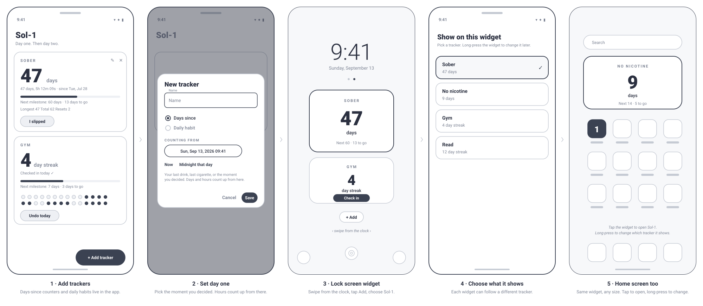

# Sol-1

**Sol-1 stands for day one.** It is a sobriety and habit tracker for Android with a widget that puts your streak on the lock screen and home screen, and keeps the number current by itself.

Site: **[sol-1.netlify.app](https://sol-1.netlify.app)** · APK: **[latest release](https://github.com/ThatMrE/Sol-1/releases/latest)**

---

## What it does

- **Days since.** Start a counter from the moment you decided: last drink, last cigarette, last anything. It counts up in days, hours, minutes and seconds.
- **Daily habits.** Gym, reading, meditation. Check in each day; miss one and the streak restarts, but the history stays.
- **I slipped.** A reset is logged, not hidden. Longest streak, total days and reset count stay on the card. Day one starts again from right now.
- **Milestones.** 1, 3, 7, 14, 30, 60, 90, 180, 365 days and beyond, with a progress bar toward the next one.
- **The widget.** Shows a tracker's name, the big number, the unit, and the next milestone. Habit widgets get a *Check in* button so you never have to open the app. Tap the widget to open Sol-1. Long-press it to change which tracker it shows. Follows your Material You colors.
- **Always current.** The count refreshes on the widget's own schedule and again just after midnight, after a reboot, and after time or time zone changes.
- **Private by design.** No account, no network, no analytics. Data lives on the phone in the app's DataStore.

## How it works



1. **Add trackers.** Days-since counters and daily habits live in the app.
2. **Set day one.** Pick the moment you decided; hours count up from there.
3. **Lock screen widget.** Swipe from the clock, tap Add, choose Sol-1.
4. **Choose what it shows.** Each widget can follow a different tracker.
5. **Home screen too.** Same widget, any size. Tap to open, long-press to change.

The frames are wireframes in `docs/wireframes/`, one SVG per step plus the combined strip.

## Install on a Pixel

1. Download `sol-1.apk` from the [latest release](https://github.com/ThatMrE/Sol-1/releases/latest) on the phone.
2. Open it and allow installs from your browser when Android asks. The build is signed with a debug key, which is fine for sideloading.
3. Open Sol-1 and add a tracker.

## Put it on the lock screen

1. **Settings → Display & touch → Lock screen → Widgets on lock screen** (Android 16 QPR2 or later).
2. Lock the phone, swipe to the widget page, tap **Add**, and pick **Sol-1**.
3. Long-press the widget to choose which tracker it shows. Add several if you track more than one thing.

The same widget goes on the home screen: long-press the home screen → **Widgets** → **Sol-1**.

## Project layout

```
android/                      Gradle project (open this folder in Android Studio)
  app/src/main/java/com/thatmre/sol1/
    data/    Models, streak maths, DataStore repository
    ui/      Compose app: tracker cards, add/edit, reset and delete dialogs
    widget/  Glance widget, receiver, midnight refresh, widget config screen
  app/src/main/res/xml/sol1_widget_info.xml   Widget metadata (home_screen|keyguard, resizable)
.github/workflows/android.yml Builds the APK on every push; publishes a release on v* tags
index.html                    The landing page at sol-1.netlify.app
```

## Building

Requirements: JDK 17, Android SDK with platform 35 and build-tools 35.0.0. Gradle 8.9 or newer.

```bash
cd android
gradle assembleDebug
# app/build/outputs/apk/debug/app-debug.apk
```

Or open `android/` in Android Studio and run it on a device. The CI workflow does the same on every push and attaches `sol-1.apk` as an artifact. Every push to `master` also publishes a GitHub release (tagged `v1.0.<run>`) with `sol-1.apk`, and pushing a `v*` tag does the same.

## Stack

Kotlin, Jetpack Compose with Material 3 (dynamic color), Glance for the app widget, DataStore Preferences with kotlinx.serialization for storage. Min SDK 31, target SDK 35.
